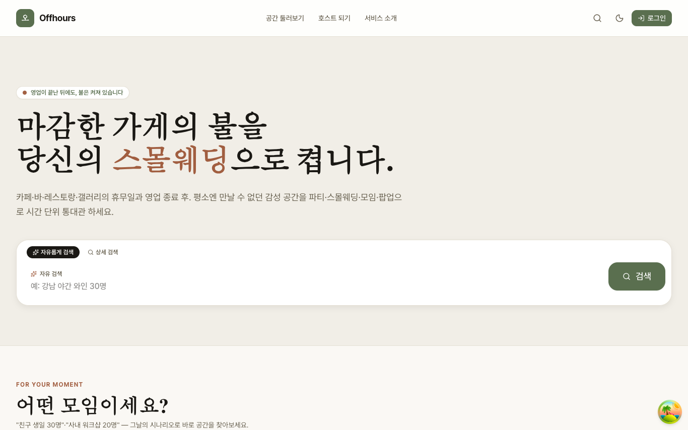
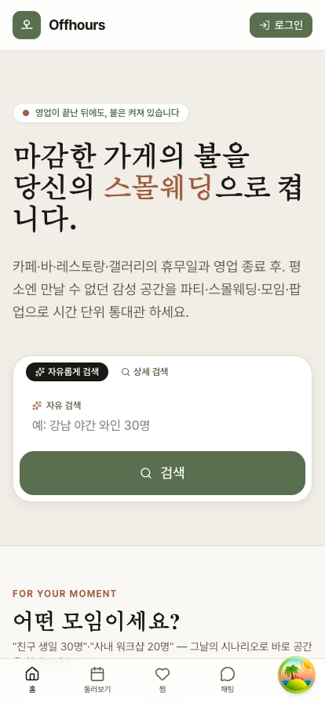

# Offhours

> 카페·바·레스토랑의 **영업 외 시간**(휴무일·마감 후)을 파티·스몰웨딩·모임·팝업 공간으로
> 매칭하는 양면시장 플랫폼. "비어 있던 그 시간, 가장 멋진 공간이 됩니다."

## 화면

<p align="center">
  
</p>

<p align="center">
  
</p>

> 데모(mock) 모드 실행 화면 — `cd apps/web && pnpm dev:mock` 으로 백엔드 없이 확인할 수 있습니다.

## 스택

| 영역     | 기술                                                                     |
| -------- | ------------------------------------------------------------------------ |
| Frontend | React 19 · Vite 8 · TanStack Query 5 · Zustand 5 · React Hook Form + Zod |
| Styling  | Tailwind 4 · Radix UI · lucide-react · Framer Motion                     |
| Backend  | NestJS 11 · Prisma 7 · PostgreSQL 16 · argon2 · nestjs-zod · nestjs-pino |
| Shared   | Zod 4 (DTO/스키마 공유)                                                  |
| Tooling  | pnpm 11 workspaces · TypeScript · Prettier · Husky · Commitlint          |
| Test     | Vitest · Testing Library · Playwright                                    |
| Infra    | Docker Compose (Postgres + Redis) · Cloud Run / Vercel                   |

## 구조

```
offhours/
├── apps/
│   ├── api/        # NestJS 11 + Prisma 7
│   └── web/        # React 19 + Vite 8
├── packages/
│   └── shared/     # Zod 스키마·타입 공유
├── docs/           # PRODUCT / ARCHITECTURE / DESIGN
├── CLAUDE.md
└── README.md
```

## 빠른 시작

```bash
# 1) 의존성 설치 + shared 빌드 (postinstall)
pnpm install

# 2) DB 실행 (Postgres + Redis)
pnpm docker:up

# 3) 환경 변수
cp .env.example .env

# 4) Prisma 스키마 적용 + 시드
pnpm db:push
pnpm seed

# 5) 개발 (pnpm이 web/api/shared 동시 기동)
pnpm dev
```

웹: http://localhost:5173 · API: http://localhost:3000 · Swagger: http://localhost:3000/api/docs

## 주요 스크립트

```bash
pnpm dev               # 전체 dev (web + api + shared watch)
pnpm dev:web           # web만
pnpm dev:api           # api만
pnpm build             # 전체 build
pnpm typecheck         # 타입 검사
pnpm lint              # ESLint (flat config, 루트 eslint.config.mjs)
pnpm test              # 단위 테스트
pnpm format            # Prettier 적용
pnpm verify            # CI (format + lint + typecheck + test + build)

pnpm db:push           # Prisma → DB
pnpm db:generate       # Prisma Client 생성
pnpm db:migrate        # migration
pnpm seed              # 시드 데이터
```

## 문서

- 📋 [PRODUCT.md](./docs/PRODUCT.md) — 기획·페르소나·MVP·KPI
- 🏗️ [ARCHITECTURE.md](./docs/ARCHITECTURE.md) — 모듈·DB·인증·결제
- 🎨 [DESIGN.md](./docs/DESIGN.md) — Quiet Luxury 디자인 시스템
- 🤖 [CLAUDE.md](./CLAUDE.md) — AI 개발 가이드

## 접근성 (a11y)

핵심 검색·예약 동선은 스크린리더·키보드 사용자를 1차 시민으로 취급한다. 컴포넌트 작성 시 다음 컨벤션을 따른다.

- **랜드마크**: 검색 영역은 `<search role="search" aria-label>`(예: `HeroSearch`), 네비게이션은 이름 있는 `<nav aria-label>`(예: `BottomNav`)로 노출한다.
- **폼 컨트롤 이름**: 시각적 라벨은 `<label htmlFor>`로 컨트롤과 연결해 접근 가능한 이름을 부여한다. 장식용 `<div>` 라벨 금지.
- **토글 상태**: 토글 버튼은 `aria-pressed`로 선택 상태를 노출한다(색상만으로 표시 금지). 활성 라우트는 `NavLink` 기본 `aria-current="page"`를 유지한다.
- **상태 알림**: 검색 결과 수·자연어 파싱 결과 등 동적 변화는 `role="status"` / `aria-live="polite"` 라이브 리전으로 알린다. 시각용 칩 등 중복 표현은 `aria-hidden`으로 가린다.
- **장식 아이콘**: lucide 아이콘 등 의미 없는 그래픽은 `aria-hidden` 처리한다.
- **검증**: a11y 회귀는 Vitest + Testing Library의 role 기반 쿼리(`getByRole`)로 테스트한다. `HeroSearch.test.tsx`·`BottomNav.test.tsx`가 레퍼런스. 외부 의존성 없이 `pnpm --filter @offhours/web test:run`으로 실행된다.

## 차별화 포인트

1. **영업외 시간 자동 슬롯** — 호스트 영업시간만 입력하면 휴무일/마감후 슬롯이 자동 생성
2. **청소 SLA + 마켓** — 예약 종료 후 청소 윈도우 강제, 제휴 청소 서비스 자동 매칭
3. **BYOB/주류 정책 템플릿** — 일반음식점/휴게음식점 유형별 가이드
4. **동적 가격** — 휴무일 < 야간 < 주말 새벽 프리미엄 자동
5. **Quiet Luxury 무드** — 정보 나열 대신 풀블리드 큐레이션

## 라이선스

UNLICENSED — Private project
